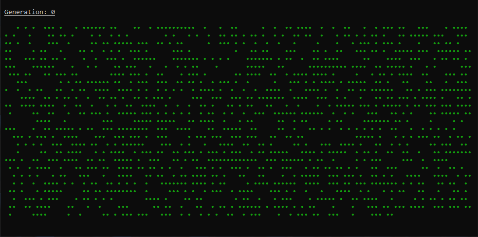

# Conway's Game of Life

Command-line simulator for Conway's Game of Life

[![CI][ci-badge]][ci]

## Demo



Recorded using [ScreenToGif][screen-to-gif].

## Help

```text
conways-game-of-life 0.0.1

USAGE:
    conways-game-of-life [OPTIONS]

FLAGS:
        --help       Prints help information
    -V, --version    Prints version information

OPTIONS:
    -c, --count <count>      Number of generations to display [default: ∞]
    -h, --height <height>    Number of vertical cells to simulate [default: terminal-height]
    -p, --period <period>    Duration to pause after displaying each generation (in milliseconds) [default: 33]
        --seed <seed>        Seed for the PRNG which produces the first generation [default: random]
    -s, --start <start>      Index of the first generation to display (zero-based) [default: 0]
    -N, --step <step>        Display only every Nth generation [default: 1]
        --weight <weight>    Probability that a cell will be alive in the first generation [default: 0.5]
    -w, --width <width>      Number of horizontal cells to simulate [default: terminal-width]
```

You can use the following keys while the program is running:

| Key                  | Behaviour                     |
| :------------------- | :---------------------------- |
| `q`, `Ctrl+c`, `Esc` | Exit                          |
| `r`                  | Restart with randomized cells |

[ci]: https://github.com/jakemarsden/conways-game-of-life.rs/actions?query=workflow%3ACI
[ci-badge]: https://github.com/jakemarsden/conways-game-of-life.rs/workflows/CI/badge.svg
[screen-to-gif]: https://www.screentogif.com/
